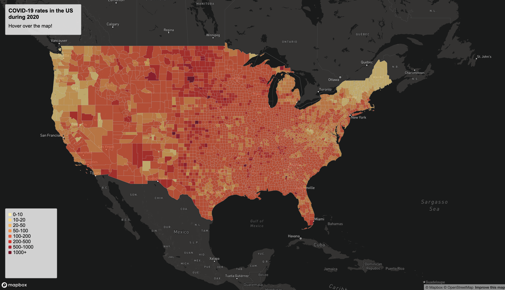
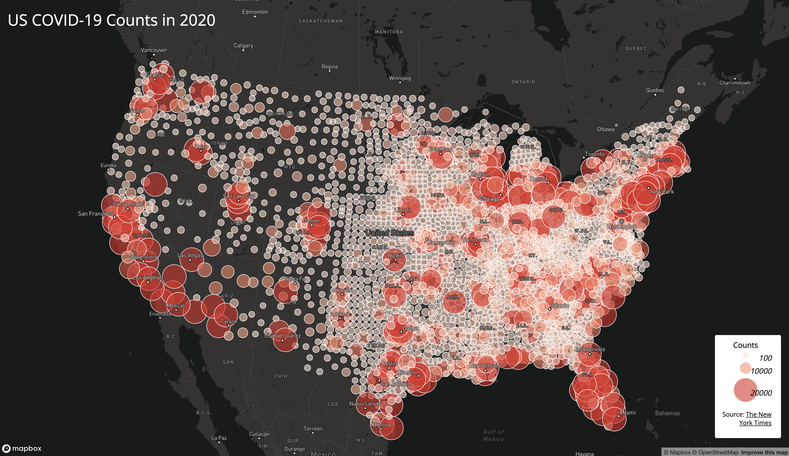

# US COVID-19 Counts and Rates during 2020

## Introduction 
 I have made web maps that display the rates and case counts of COVID-19 in the United States during the year 2020. The first map is a cloropleth map that shows the rates by county. The rates are shown in diverging color scale of yellow to red as the rates increase from 10 to 1000 per thousand residents per county. The second map is a proportional symbol map that displays the case counts across the US in three categories: more than 100, more than 10,000, and more than 20,000. 

## Sources and Acknoledgements
 These maps used data collected from [The New York Times](https://github.com/jakobzhao/geog458/tree/master/labs/lab03#:~:text=are%20originally%20from-,The%20New%20York%20Times,-.%20The%20data%20include) and [US Census Beurau](https://data.census.gov/cedsci/table?g=0100000US.050000&d=ACS%205-Year%20Estimates%20Data%20Profiles&tid=ACSDP5Y2018.DP05&hidePreview=true). This data was proccessed by Steven Bao, thanks. [Mapshaper](mapshaper.org) was used to convert shapefile data to geojson data. 

 ## Functions and Libraries
These maps used mapbox for styling the maps and event listeners in javascript to make them interactive. The Google fonts library was also used for the font displayed on the web maps.

